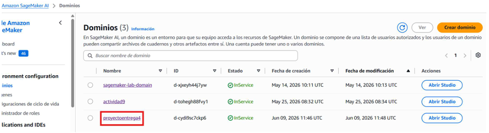
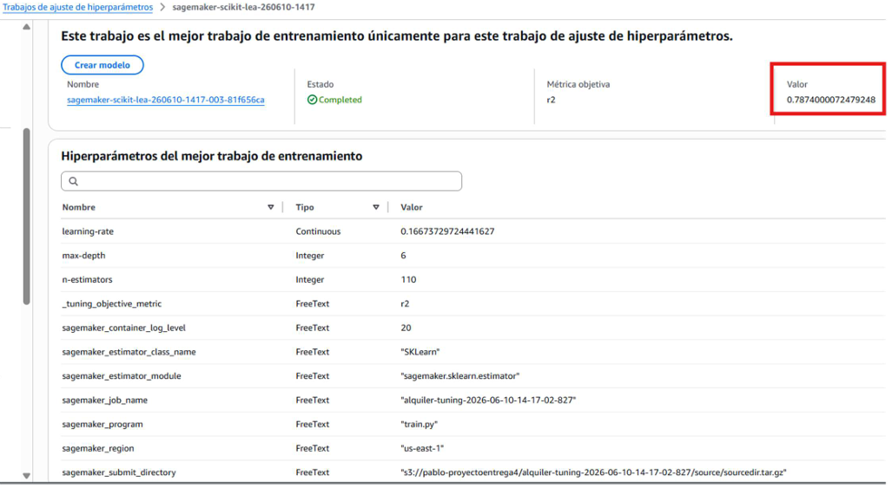
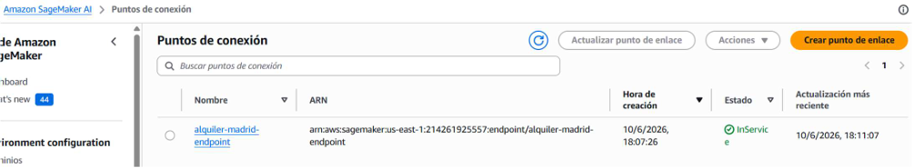
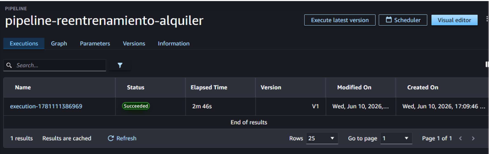

# Madrid Rental Price Prediction — End-to-End MLOps on AWS

Production deployment of a rental-price regression model on **AWS SageMaker**, covering the full machine learning lifecycle: data ingestion and ETL, training, hyperparameter tuning, bias auditing, model registry, real-time inference and continuous monitoring.

Built as the final project of the *Professional Programme in Artificial Intelligence & Data Science* (UNIR, 2026), following the CRISP-DM methodology.

---

## Architecture

```
Raw data (S3 /raw)
        │
        ▼
AWS Glue — PySpark ETL ──────► Glue Data Catalog
        │
        ▼
Processed data (S3 /processed)
        │
        ▼
SageMaker Training ──► Automatic Model Tuning (Bayesian)
        │
        ▼
SageMaker Clarify (bias) ──► Model Registry (versioning)
        │
        ▼
Real-time inference endpoint (ml.m5.large)
        │
        ▼
Model Monitor + CloudWatch ──► SageMaker Pipelines (retraining)
```

| Lifecycle stage | AWS services |
|---|---|
| Ingestion & preprocessing | S3, AWS Glue (PySpark), Glue Data Catalog |
| Training & tuning | SageMaker Training, Experiments, Automatic Model Tuning |
| Evaluation & registry | SageMaker Clarify, Model Registry |
| Deployment | SageMaker Hosting (real-time endpoint) |
| Monitoring | Model Monitor, CloudWatch, SageMaker Pipelines |



---

## Results

| Model | R² | Notes |
|---|---|---|
| GradientBoosting (baseline) | 0.7191 | Default hyperparameters |
| GradientBoosting (tuned) | **0.7874** | Bayesian tuning, 4 parallel jobs |

Automatic Model Tuning improved explanatory power by **9.5%** without changing a single line of model code, exploring the hyperparameter space in ~6 minutes through Bayesian optimisation rather than exhaustive grid search.

Baseline test metrics: MAE 447.61 € · RMSE 844.93 € · R² 0.7191.

> **Note on scale:** the target variable spans a wide price range, so absolute errors in euros should be read alongside R² rather than in isolation.

---

## Dataset

*Madrid Province Rent Data* — thousands of rental listings with physical, location and amenity features.
Source: [`https://www.kaggle.com/datasets/mapecode/madrid-province-rent-data`]([URL])

The dataset is **not** included in this repository. To reproduce, download it and upload to `s3://<your-bucket>/raw/`.

---

## Repository structure

```
├── glue/
│   └── etl_job.py                       # PySpark ETL job (cleaning, typing, feature prep)
├── sagemaker/
│   ├── train.py                         # training script executed by SageMaker Training
│   ├── 01_training.ipynb
│   ├── 02_experiments.ipynb
│   ├── 03_tuning_and_clarify.ipynb
│   └── 04_registry_deploy_monitoring.ipynb
├── docs/images/                         # console screenshots
└── requirements.txt
```

---

## Pipeline walkthrough

### 1. Ingestion and ETL — AWS Glue

A PySpark job reads raw listings from `s3://<bucket>/raw/`, drops duplicates, casts numeric types, filters null/invalid prices and trims the top and bottom 1% as outliers. Missing values are imputed (median for numeric columns, "Desconocido" for categoricals, 0 for boolean amenities), and two derived columns are added: property age (`antiguedad`) and price per square metre (`precio_por_m2`, kept for analysis, excluded from training to avoid leakage). The result is written to `s3://<bucket>/processed/` and the schema is registered in the Glue Data Catalog.

### 2. Training and tuning — SageMaker

`train.py` trains a GradientBoosting regressor on the processed data. Runs are grouped under a **SageMaker Experiment** (`alquiler-madrid-precio`) so metrics are comparable across configurations.

**Automatic Model Tuning** then launches parallel training jobs with a Bayesian search strategy (`max_jobs=4`, `max_parallel_jobs=2`), maximising R² over the ranges `n_estimators [50, 200]`, `max_depth [3, 8]`, `learning_rate [0.01, 0.3]`. Best configuration: `learning_rate=0.1667`, `max_depth=6`, `n_estimators=110` → R² 0.7874.



### 3. Bias auditing — SageMaker Clarify

A pre-training bias analysis was configured with `district` as the facet and a €500/month target threshold, checking whether the training data encodes geographic price bias before the model learns it.

Results show Class Imbalance (CI) close to 1.0 for nearly every district — expected, since `district` has very high cardinality (down to individual neighbourhoods and developments) and no single value dominates the dataset. Difference in Positive Proportions in Labels (DPL) stayed around −0.002, indicating no meaningful disparity in how the €500 price threshold is distributed across districts.

This step reflects **EU AI Act (Regulation 2024/1689)** data governance requirements: housing-access systems fall under Annex III, and bias examination is an explicit obligation under Art. 10.

### 4. Registry and deployment

The tuned model is versioned in the **Model Registry** for traceability. The artefact referenced by the winning tuning job failed the endpoint's ping health check on deployment, so the model was retrained with an equivalent, close configuration (`n_estimators=150`, `max_depth=6`, `learning_rate=0.05` → R² 0.7631) and deployed to a real-time inference endpoint (`alquiler-madrid-endpoint`) on an `ml.m5.large` instance, with an `AllTraffic` production variant that allows future A/B or canary deployments by adding variants.



Test inference returned a price estimate consistent with real market values, confirming the endpoint works end to end.

### 5. Monitoring and retraining

**Model Monitor** generates a statistical baseline in S3 (`constraints.json`, `statistics.json`) used as the reference for detecting future data drift. A monitoring schedule runs hourly (`cron(0 * ? * * *)`, DataQuality type), logs are centralised in **CloudWatch**, and **SageMaker Pipelines** automates retraining.



---

## Known limitations

- `train.py` fits `LabelEncoder` on categorical columns at training time but does not persist the encoders, so the endpoint only accepts pre-encoded integers with no documented mapping (e.g. which integer corresponds to which district). A serialized `sklearn.Pipeline` with a `ColumnTransformer` would close this gap.
- The endpoint currently serves a retrained model (R² 0.7631) rather than the exact artefact registered in the Model Registry (R² 0.7874), due to a deployment failure documented above.

---

## Engineering constraints

Development ran on a restricted AWS lab environment with limited IAM permissions. This forced explicit architectural decisions — reusing an existing execution role instead of provisioning a scoped one, and configuring public internet access for the networking layer — that mirror common constraints in enterprise environments where permissions are centrally controlled.

All resources were torn down after each session to avoid idle billing.

---

## Reproducing

```bash
pip install -r requirements.txt
```

1. Create an S3 bucket with `raw/`, `processed/` and `models/` prefixes.
2. Upload the dataset to `raw/`.
3. Run the Glue job in `glue/etl_job.py`.
4. Execute the SageMaker notebooks in numerical order.

Requires an AWS account with SageMaker, Glue and S3 permissions.

---

## What this project covers

- PySpark ETL at scale on managed infrastructure
- Experiment tracking and reproducible training jobs
- Bayesian hyperparameter optimisation
- Fairness auditing under EU AI Act requirements
- Model versioning and lineage
- Real-time inference serving
- Data drift detection and automated retraining

---

## Related work

This repository is one phase of a four-part AI system for the Madrid property market. See also:
**[NLP Model Benchmark](`[enlace al otro repo]`)** — comparing TF-IDF + SVR, Word2Vec + CNN and a fine-tuned Spanish transformer (BERTIN-RoBERTa) for price prediction from listing text alone.

---

**Pablo Iribarren** · [LinkedIn](https://www.linkedin.com/in/pablo-iribarren-muru) · p11iribarren@gmail.com
